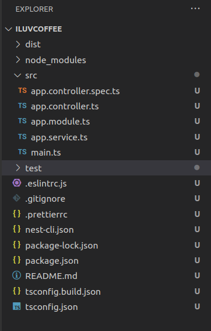
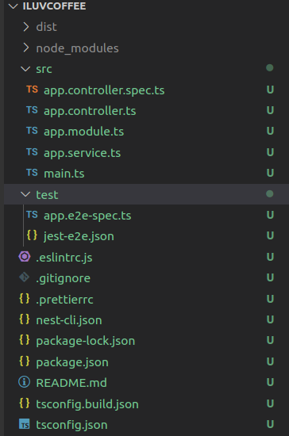
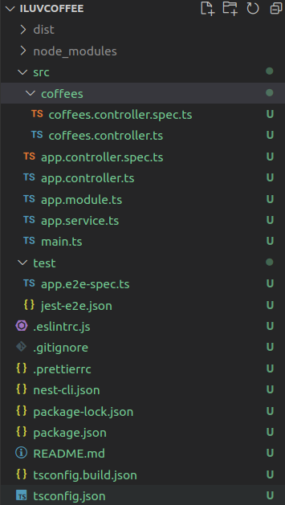

# Index
- [Index](#index)
- [Intro](#intro)
- [Installating Nest, Creating and Running Project](#installating-nest-creating-and-running-project)
- [Components of  a Nest Application](#components-of--a-nest-application)
- [Nest Development Mode](#nest-development-mode)
- [REST API](#rest-api)
  - [Make Controller](#make-controller)
  - [Add handler to Controllers](#add-handler-to-controllers)
  - [Use Route Parameters](#use-route-parameters)
  - [Use Request Payload](#use-request-payload)
  - [Response Status Code](#response-status-code)
  - [Handling Update and Delete](#handling-update-and-delete)
  - [Implement Pagination](#implement-pagination)
- [Contr](#contr)

# Intro

NodeJS makes no assumption and includes almost nothing by default, for it's purposely meant  to be very bare bones. NodeJS by design have a minimalistic setup and developers are incharge of setting up everything they want to use in for their application.
This applies to eveything, how you handle:
- routing
- API calls
- set up web sockets
- code organization
- name conventions

This flexibility can be bit of a double edged sword, creating potential problems as applications or teams grow very large.

> NestJS solves all of these potential problems by providng a abstraction or overall framework around NodeJS. Letting you focus on the application and not on the tiny details NestJS provides out of the box application architecture.

NestJS provides you architecture/modules that is/are:
- platform agnostic
- HTTP framwork agnostic
  - express
  - fastify
  - etc

> With the help of dependency injection we can swap out the underlying mechanism effortlessly.

# Installating Nest, Creating and Running Project


```
<!-- install -->
npm i -g @nestjs/cli

<!-- new nest project -->
nest new

<!-- run project -->
nest start

<!-- Served on port 3000 -->
```

# Components of  a Nest Application



- Core of nest app lives in `src` directory
- Entire application starts with the `main.ts`

**main.ts**
```ts
import { NestFactory } from '@nestjs/core';
import { AppModule } from './app.module';

async function bootstrap() {
  const app = await NestFactory.create(AppModule);
  await app.listen(3000);
}
bootstrap();

```

- Inside `main.ts` you can see that entire application is created via `NestFactory.create` taking in an `AppModule`
- `AppModule` is root module that contains everything that our app needs to run

**app.module.ts**

```ts
import { Module } from '@nestjs/common';
import { AppController } from './app.controller';
import { AppService } from './app.service';

@Module({
  imports: [],
  controllers: [AppController],
  providers: [AppService],
})
export class AppModule {}

```

- Decorators are simply functions that apply logic, they can be applied to methods, functions, classes and even parameters
- Decorator of `AppModule` encapsulates everything that is important in that modules context
  - **controllers**
  - **providers**


- Controllers are where specific **requests** of your application are handled, in below controller **Get** request is handled

**app.controller.ts**
```ts
import { Controller, Get } from '@nestjs/common';
import { AppService } from './app.service';

@Controller()
export class AppController {
  constructor(private readonly appService: AppService) {}

  // since no route specified so, it will be used for root route,
  // i.e. get localhost:3000
  @Get()
  getHello(): string {
    return this.appService.getHello();
  }
}

```

> You can see above that `AppController` utilizes `AppService` **Provider** to separate out business logic from the controller itself, **Provider**s like this work for **dependency injection**.

- `AppController` gets initialized with service
- Contollers just control which method of service provider to call on which request, they don't know the business logic, abstraction
- But which service provider to use? It is told via constructor, initializing it with service provider  (***this is a class***), here named `appService`  initialized with `AppService`
- `AppService` class contains method `getHello`

**app.service.ts**

```ts
import { Injectable } from '@nestjs/common';

@Injectable()
export class AppService {
  getHello(): string {
    return 'Hello World!';
  }
}

```


> You can see **service** is made **injectable**, to allow **dependency injection** and to **separate business logic from the controller** itself.


# Nest Development Mode

Nest offers two scripts to run your project:
- `npm run start`
- `npm run start:dev`
  - gives realtime compilations and automatic server rebuilds whenever we save changes to files


# REST API


## Make Controller

- Controller are the most important building blocks of NestJS applications as they handle requests
- You can create a controller by running the below commands, lets say controller name is `coffees`:
  - if you don't want to include the test file include `--no-spec` to the command
  - if you want to add new controller to **custom directory** add it to the name of controller in `g` command
    - there would still be a directory of the name of your controller, but it would be inside your custom named directory


```sh
nest generate controller coffees

# nest g co
```

- The above command automatically creates the **controller** and the associated **test file** for it

Before running the command, the project directory looks like:



After the command it looks like this:



**The command also updates `app.modules.ts` and adds the new controller to the app**
<br>

**app.modules.ts**
```js
import { Module } from '@nestjs/common';
import { AppController } from './app.controller';
import { AppService } from './app.service';
import { CoffeesController } from './coffees/coffees.controller';

@Module({
  imports: [],
  controllers: [AppController, CoffeesController],
  providers: [AppService],
})
export class AppModule {}

```

- `nest g co modules/coffees` will create `modules/coffees` directory inside `src`, and your files will be inside `coffees` folder
- use `dry-run` flag to view simulated output
- newly created `coffees` controller have the following code:

```js
import { Controller } from '@nestjs/common';

@Controller('coffees')
export class CoffeesController {}

```

> NOTE: Controllers handle requests, but how App knows which controller handles a specific URL, controller decorators can be passed a string and metadata needed for Nest to create a routing map. `/coffees` url will go to `Coffees` controller because the decorator of `CoffeesController` takes this as string. 

## Add handler to Controllers

- Currently no handler attached to `CoffeesController`
- To add handler for `GET` request to route `coffee` of server, we can add following code
  - Note that name of method doesn't matter, only the `GET` decorator matters 

```js
import { Controller, Get } from '@nestjs/common';

@Controller('coffees')
export class CoffeesController {
  @Get()
  findAll() {
    return 'This action returns all coffees, when you go to `[host]:[port]/coffees`';
  }

  @Get(`flavors`)
  findAll() {
    return 'This action returns all coffees, when you go to `[host]:[port]/coffees/flavors`';
  }
}
```

> NOTE: Observe the second Get decorator, it creates nested path and appends it to that of controller, i.e. `host:port/[controller_deco_string]/[http_req_deco_string]`

## Use Route Parameters

- routes with static paths won't work when you need dynamic data as part of your request
- lets say we made a get request to `/coffees/123` where `123` is dynamic and referring to an `ID`
- you can get the `params` object as shown below:

```js
  @Get(':id')
  findOne(@Param() params){
    return `This action returns ${params.id} coffee`
  }
```

- in order to get only the required attribute from the object:

```js
  @Get(':id')
  findOne(@Param('id') id:string){
    return `This action returns ${id} coffee`
  }
```

## Use Request Payload

```js
  @Post()
  create(@Body() body) {
    return body;
  }
```

- to access specific attribute from the payload and not the entire body

```js
  @Post()
  create(@Body('name') body) {
    // not body, instead just name
    return body;
  }
```

## Response Status Code

- if your route is deprecated then you can use custome codes like below


```js
  @Post()
  @HttpCode(HttpStatus.GONE)
  // The HyperText Transfer Protocol (HTTP) 410 Gone client error response code
  // indicates that access to the target resource is no longer available
  // at the origin server and that this condition is likely to be permanent.
  create(@Body() body) {
    return body;
  }
```

> In Nest you can use underlying library specific response objects, by default Nest is using Express under the hood

- to access underlying response objects, Nest has a decorator called `Res`

```js
 @Get()
  findAll(@Res() response) {
    response.status(200).send('This action returns all coffees')
}
```

> NOTE: `Res` should be used with care, you lose compatibility with `Nest` features that depend on Nest response handlers.
> When we use `Res` then out code becomes platform dependent.

## Handling Update and Delete 

```js
  @Patch(':id')
  update(@Param('id') id:string, @Body() body) {
    return `this action updates ${id} coffee with body ${body}`
  }

```

## Implement Pagination

# Contr

- add dotenv
- add port on console when we run project